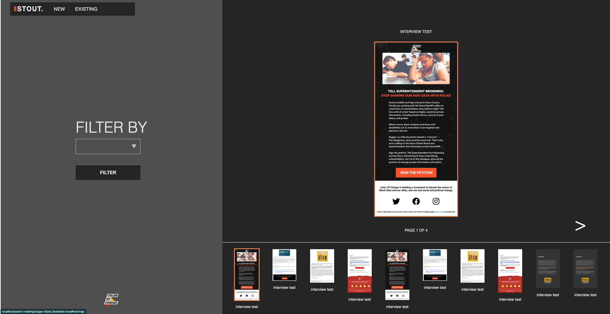
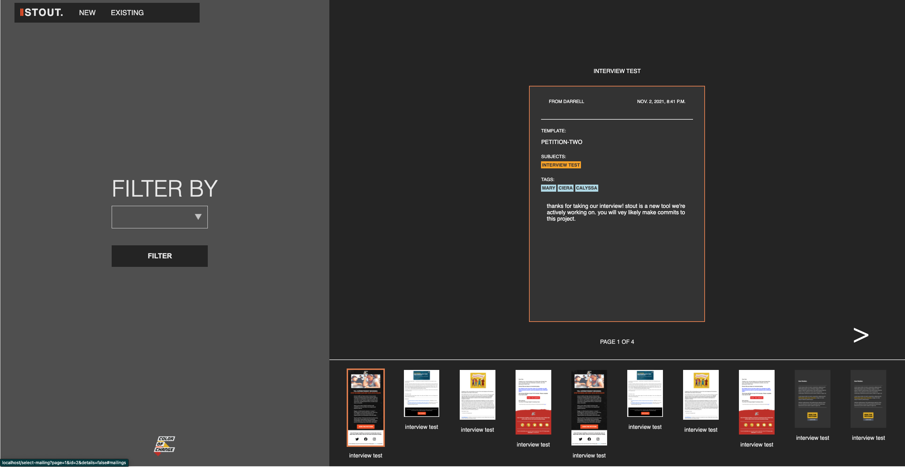

# COC Engineering challenge

| Hi, this is my take on the interview challenge. Thank you for taking the time to look at this project!

## Here's what I worked on :

- Fixing the /select-mailing page which needed to display 2 columns instead of 3
- Creating mailing objects in the mailing.json fixture file
- Creating a Paginator with all mailing objects in the layout/views.py file
- Displaying all mailing objects in the /select-mailing page
- Implementing user controlled pagination in the /select-mailing page
- Styling the /select-mailing page
- Implementing clicking on a mailing object to show or hide its details(see in screenshots)

## Screenshots

### Click on a mailing object to show or hide its details

## Icebox Items :

- Updated the /selection page to directly display templates when a user clicks on it
- Did a little bit of responsive design on the whole app